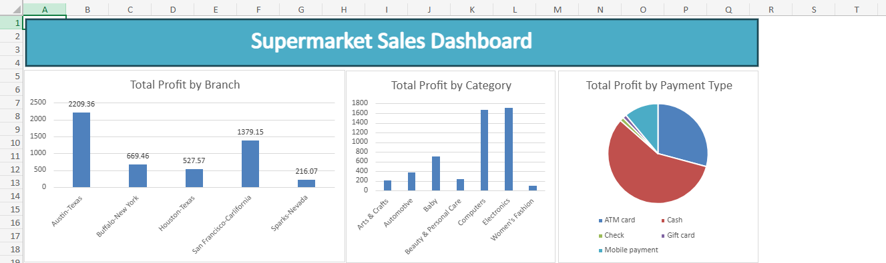

# Supermarket Sales Analysis

## Problem
The company needs to identify which branches and product 
categories generate the most profit, and understand 
customer payment preferences.

## Dataset
- Source: Kaggle - Supermarket Sales Dataset
- 1,000 real sales records
- Branches: Austin-Texas, San Francisco-California, 
  Buffalo-New York, Houston-Texas, Sparks-Nevada
- Period: 2021
- Columns: Branch, Category, Sub-Category, Product, 
  Price, Cost Price, Payment Type, Order Date, Profit

## Tool Used
- Microsoft Excel
  - Pivot Table
  - Conditional Formatting
  - Dashboard (3 Charts)

## Key Findings
- Total Profit: $5,001.61
- Best Branch: Austin-Texas with $2,209.36 (44% of total profit)
- Best Category: Electronics with $1,712.73
- Most Used Payment: Cash with $2,865.93 (57% of total profit)
- Worst Branch: Sparks-Nevada with only $216.07

## Decision & Recommendations
- Invest more in Austin-Texas as it is the top performer
- Focus on Electronics and Computers as they drive most profit
- Encourage Cash and ATM payments as they dominate transactions
- Review Sparks-Nevada branch strategy urgently
- Women's Fashion needs attention as it has the lowest profit

## Dashboard

## Files
- supermarket_sales_analysis.xlsx : Raw data, analysis and dashboard
